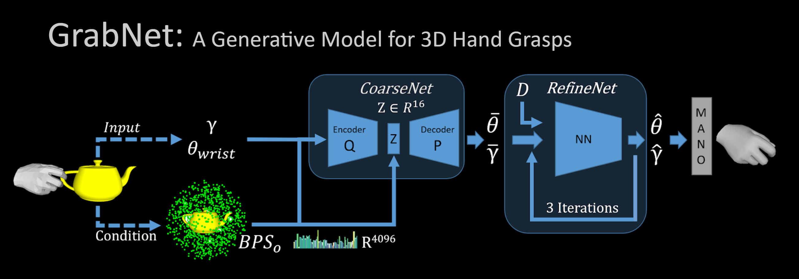
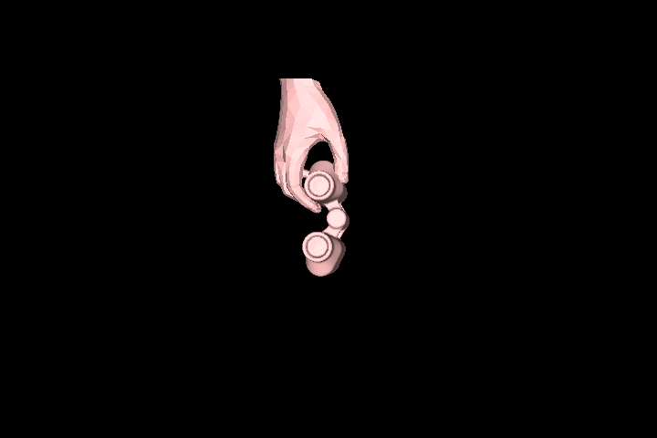
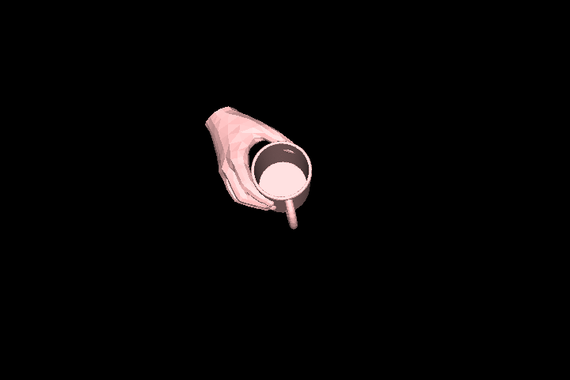
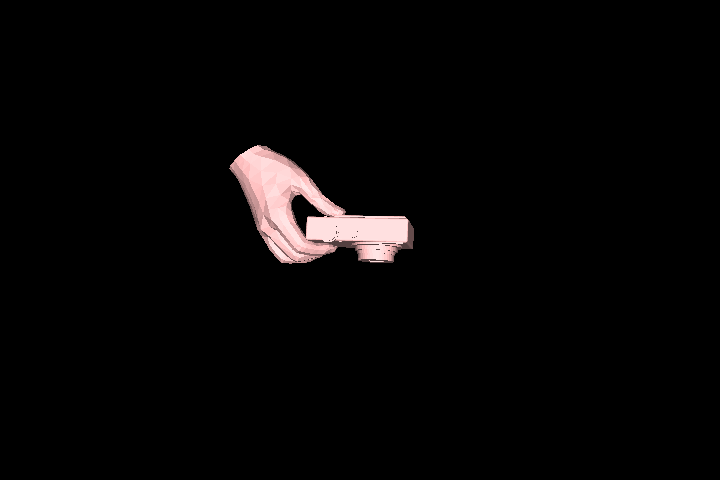
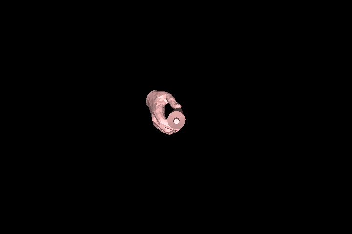

# GrabNet
### Generating realistic hand mesh grasping unseen 3D objects (ECCV 2020)


[](https://arxiv.org/abs/2008.11200)

### Run in Google-Colab
[](https://colab.research.google.com/drive/1c8OfrHhkwtyb0m75QHO0Dpj1IAgDcaqQ)


[[Paper Page](https://grab.is.tue.mpg.de)] 
[[Paper](http://grab.is.tue.mpg.de//uploads/ckeditor/attachments/363/grab_eccv2020.pdf) ]
[[Supp. Mat.](https://www.ecva.net/papers/eccv_2020/papers_ECCV/papers/123490562-supp.pdf)]

[GrabNet](http://grab.is.tue.mpg.de) is a generative model for 3D hand grasps. Given a 3D object mesh, GrabNet 
can predict several hand grasps for it. GrabNet has two succesive models, CoarseNet (cVAE) and RefineNet.
It is trained on a subset (right hand and object only) of [GRAB](http://grab.is.tue.mpg.de) dataset.
For more details please refer to the [Paper](http://grab.is.tue.mpg.de//uploads/ckeditor/attachments/363/grab_eccv2020.pdf) or the [project website](http://grab.is.tue.mpg.de).

Below you can see some generated results from GrabNet:

| Binoculars | Mug |Camera | Toothpaste|
| :---: | :---: |:---: | :---: |
| ||||


Check out the YouTube videos below for more details.

| Long Video | Short Video |
| :---: | :---: |
|  [](https://youtu.be/s5syYMxmNHA) | [](https://youtu.be/VHN0DBUB4H8) |  


## Table of Contents
  * [Description](#description)
  * [Requirements](#requirements)
  * [Installation](#installation)
  * [Getting Started](#getting-started)
  * [Examples](#examples)
  * [Citation](#citation)
  * [License](#license)
  * [Acknowledgments](#acknowledgments)
  * [Contact](#contact)


## Description

This implementation:

- Can run GrabNet on arbitrary objects provided by users (incl. computing on the fly the BPS representation for them).
- Provides a quick and easy demo on google colab to generate grasps for any given object.
- Can run GrabNet on the test objects of our dataset (with pre-computed object centering and BPS representation).
- Can retrain GrabNet, allowing users to change details in the training configuration.


## Requirements
This package has the following requirements:

* [Pytorch>=1.1.0](https://pytorch.org/get-started/locally/) 
* Python >=3.6.0
* [pytroch3d >=0.2.0](https://pytorch3d.org/) 
* [MANO](https://github.com/otaheri/MANO) 
* [bps_torch](https://github.com/otaheri/bps_torch) 
* [psbody-mesh](https://github.com/MPI-IS/mesh) (for visualization)

## Installation

To install the dependencies please follow the next steps:

- Clone this repository: 
    ```Shell
    git clone https://github.com/otaheri/GrabNet
    ```
- Install the dependencies by the following command:
    ```
    pip install -r requirements.txt
    ```

## Getting started

For a quick demo of GrabNet you can give it a try on [google-colab here](https://colab.research.google.com/drive/1c8OfrHhkwtyb0m75QHO0Dpj1IAgDcaqQ).

Inorder to use the GrabNet model please follow the below steps:


#### CoarseNet and RefineNet models
- Download the GrabNet models from the [GRAB website](https://grab.is.tue.mpg.de), and move the model files to the models folder as described below.
```bash
    GrabNet
        ├── grabnet
        │    │
        │    ├── models
        │    │     └── coarsenet.pt
        │    │     └── refinenet.pt
        │    │     │
```

#### Mano models
- Download MANO models following the steps on the [MANO repo](https://github.com/otaheri/GrabNet) (skip this part if you already followed this for [GRAB dataset](https://github.com/otaheri/GRAB)).

#### GrabNet data (only required for retraining the model or testing on the test objects)
- Download the GrabNet dataset (ZIP files) from [this website](http://grab.is.tue.mpg.de). Please do NOT unzip the files yet.
- Put all the downloaded ZIP files for GrabNet in a folder.
- Clone this repository and install the requirements: 
    ```Shell
    git clone https://github.com/otaheri/GrabNet
    ```
- Run the following command to extract the ZIP files.

    ```Shell
    python grabnet/data/unzip_data.py   --data-path $PATH_TO_FOLDER_WITH_ZIP_FILES \
                                        --ectract-path $PATH_TO_EXTRACT_DATASET_TO
    ```
- The extracted data should be in the following structure.
```bash
    GRAB
    ├── data
    │    │
    │    ├── bps.npz
    │    └── obj_info.npy
    │    └── sbj_info.npy
    │    │
    │    └── [split_name] from (test, train, val)
    │          │
    │          └── frame_names.npz
    │          └── grabnet_[split_name].npz
    │          └── data
    │                └── s1
    │                └── ...
    │                └── s10
    └── tools
         │
         ├── object_meshes
         └── subject_meshes
```


## Examples

After installing the *GrabNet* package, dependencies, and downloading the data and the models from
 mano website, you should be able to run the following examples:


- #### Generate several grasps for new unseen objects
    
    ```Shell
    python grabnet/tests/grab_new_objects.py --obj-path $NEW_OBJECT_PATH \
                                             --rhm-path $MANO_MODEL_FOLDER
                                            

- #### Generate grasps for test data and compare to ground truth (GT)
    
    ```Shell
    python grabnet/tests/test.py     --rhm-path $MANO_MODEL_FOLDER \
                                     --data-path $PATH_TO_GRABNET_DATA
    ```

- #### Train GrabNet with new configurations 
    
    To retrain GrabNet with a new configuration, please use the following code.
    
    ```Shell
    python train.py  --work-dir $SAVING_PATH \
                     --rhm-path $MANO_MODEL_FOLDER \
                     --data-path $PATH_TO_GRABNET_DATA
    ```
    
- #### Get the GrabNet evaluation errors on the dataset 
    
    ```Shell
    python eval.py     --rhm-path $MANO_MODEL_FOLDER \
                       --data-path $PATH_TO_GRABNET_DATA
    ```


## Citation

```
@inproceedings{GRAB:2020,
  title = {{GRAB}: A Dataset of Whole-Body Human Grasping of Objects},
  author = {Taheri, Omid and Ghorbani, Nima and Black, Michael J. and Tzionas, Dimitrios},
  booktitle = {European Conference on Computer Vision (ECCV)},
  year = {2020},
  url = {https://grab.is.tue.mpg.de}
}
```

## License
Software Copyright License for **non-commercial scientific research purposes**.
Please read carefully the terms and conditions in the [LICENSE file](https://github.com/otaheri/GRAB/blob/master/LICENSE) and any accompanying documentation
before you download and/or use the GRAB data, model and software, (the "Data & Software"),
including 3D meshes (body and objects), images, videos, textures, software, scripts, and animations.
By downloading and/or using the Data & Software (including downloading,
cloning, installing, and any other use of the corresponding github repository),
you acknowledge that you have read these terms and conditions, understand them,
and agree to be bound by them. If you do not agree with these terms and conditions,
you must not download and/or use the Data & Software. Any infringement of the terms of
this agreement will automatically terminate your rights under this [License](./LICENSE).


## Acknowledgments

Special thanks to [Mason Landry](https://ps.is.tuebingen.mpg.de/person/mlandry) for his invaluable help with this project.

We thank:
* Senya Polikovsky, Markus Hoschle (MH) and Mason Landry (ML) for the MoCap facility. 
* ML, Felipe Mattioni, David Hieber, and Alex Valis for MoCap cleaning. 
* ML and Tsvetelina Alexiadis for trial coordination, and MH and Felix Grimminger for 3D printing, 
* ML and Valerie Callaghan for voice recordings, Joachim Tesch for renderings. 
* Jonathan Williams for the website design, and Benjamin Pellkofer for the IT and web support.
* Sergey Prokudin for early access to BPS code.
* Sai Kumar Dwivedi and Nikos Athanasiou for proofreading.

## Contact
The code of this repository was implemented by [Omid Taheri](https://ps.is.tuebingen.mpg.de/person/otaheri) and [Nima Ghorbani](https://ps.is.tuebingen.mpg.de/person/nghorbani).

For questions, please contact [grab@tue.mpg.de](grab@tue.mpg.de).

For commercial licensing (and all related questions for business applications), please contact [ps-licensing@tue.mpg.de](ps-licensing@tue.mpg.de).

